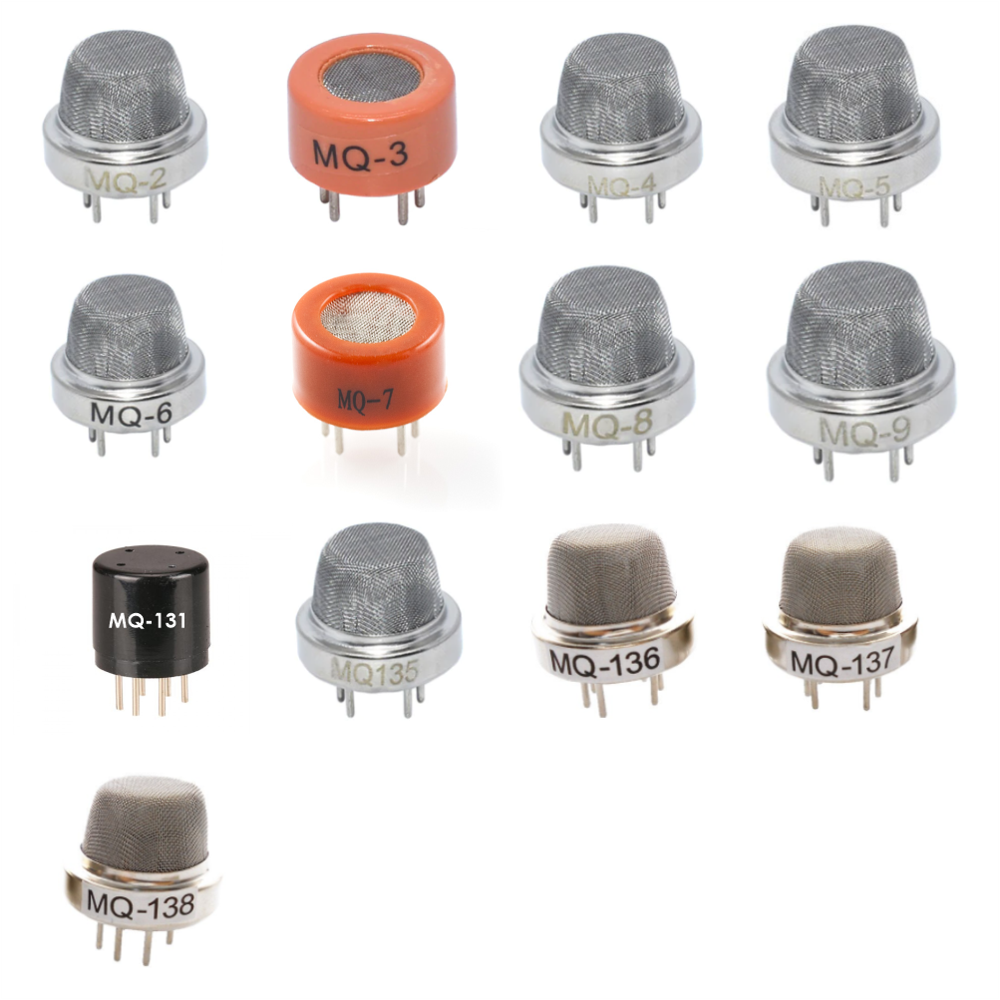
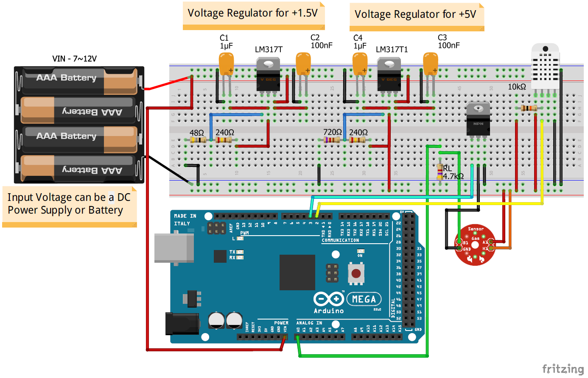
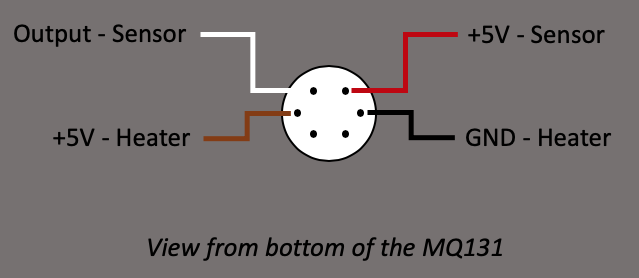
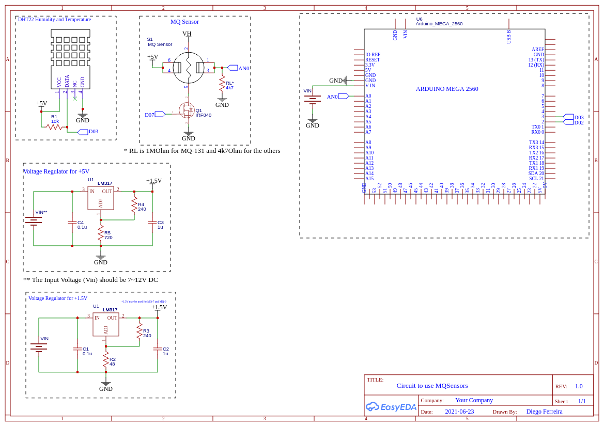

# MQSLib
An open-source library for programming low-cost gas and pollution MQ sensors
***



## Description

**MQSLib is a library for programming `MQ Sensors` with DHT-22 (Temperature/Humidity Sensor)**

This library is mainly recommended for air quality control applications based on low-cost sensors.

It is highly recommended to use MQ sensors associated with temperature and humidity sensors. Also, It's fundamental to calibrate the sensor before using it. The sensor DHT-22 was used for this purpose.

For now, the library was already tested for the following sensors: MQ-131 (Ozone), MQ-136 (Hydrogen Sulfide) and MQ-7 (Carbon Monoxide). However, considering that the principle of operation for MQ sensors is the same, this library should work with many similar sensors.

Thus, MQSLib can be used to programming an extensive list of MQ sensors. Table 1 shows such a list where it is highlighted the sensor and the respective gas.

MQ SENSOR | GAS
------------ | -------------
MQ-2 |Propane C3H8 and Smoke
MQ-3 |Alcohol Gas C2H5OH
MQ-4 |Methane CH4
MQ-5 |Methane CH4 - Propane C3H8 - Butane C4H10
MQ-6 |Propane C3H8
MQ-7 |Carbon Monoxide CO
MQ-8 |Hydrogen Gas H2
MQ-9 |Carbon Monoxide CO - Methane CH4 - Propane C3H8
MQ-131 |Ozone O3 (Low Concentration)
MQ-135 |Ammonia NH3 - Toluene C7H8 - Hydrogen Gas H2
MQ-136 |Hydrogen Sulfide H2S
MQ-137 |Ammonia NH3
MQ-138 |Alcohol Gas C2H5OH - Toluene C7H8 - Acetone C3H6O


## To know before starting...

  * MQ Sensors are [semiconductor gas sensors](https://en.wikipedia.org/wiki/Gas_detector#Semiconductor) composed by a heater circuit and a sensor circuit.
  * MQ Sensors require minimum 48h (or 24h depending on each sensor, must be verified in the datasheet) preheat time before giving consistent results (also called "burn-in" time).
  * Heater consumes at least 100 mA. So, __don't connect it directly on a pin of the Arduino__.
  * It is important to respect the pinout of the sensor. If you put Vcc on the sensor and not on the heater, __you could damage your sensor irreversibly.__ 
  * This library also uses a Temperature and Humidity sensor the DHT-22 (also can be used DHT-11).
  * Each MQ Gas Sensor is sensitive to more than one gas, but according to the datasheets each sensor is more sensitive to a specific gas.
  
### Observations
  
  **1.  How does a semiconductor gas sensor work?**
  
  In short, MQ-series sensors are semiconductors gas sensors, in other words, it means that the resistence of the     sensor envolves depending on the quantity of gas particles that are measured in the air. In order to measure those gas particles, the heater burns the air and the sensor detects gases by a chemical reaction when the gas comes in direct contact with the sensor.
  
  As Olivier Staquet explained:
  
> In a very simplified way, you burn the air and see the remaining of the burning to measure the quantity of gas. The heating time depends on your sensor, that's why it is part of the calibration process.

  **2. Is the burn-in-time of 48h or 24h important?**
  
  The burn-in-time is really important because it burns all remaining particles from the factory process. The remaining particles of the factory influence the measures and the burn-in-time will stabilize the chemical reaction on the MQ Sensor.
  
  As Olivier Staquet said: 
  
  > In a simplified way, the burn-in time clean up your sensor before using it.
  
  **3. Which diferences there are between this library and [ostaquet/Arduino-MQ131-driver](https://github.com/ostaquet/Arduino-MQ131-driver)?**
  
   
   There are some differences in how this library works and the [ostaquet/Arduino-MQ131-driver](https://github.com/ostaquet/Arduino-MQ131-driver). Mainly because here the focus is to use the code for all MQ serie sensors instead of only MQ-131 (Gas sensor for ozone).

  **4. Important point about MQ-131 - Gas Sensor for Ozone **
  
  * There are three different MQ131: 
   * a black bakelite sensor for low concentration of ozone (with WO3 sensitive material)
   * a blue bakelite sensor for low concentration of ozone (with SnO2 sensitive material)
   * a metal sensor for high concentration of ozone.
   
  This library only work for the _black bakelite sensor for low concentration of ozone_. [ostaquet/Arduino-MQ131-driver](https://github.com/ostaquet/Arduino-MQ131-driver) is recommended for the other versions.    


## Circuit
  
  * Sensor heating is controlled by MOSFET N-chanel (IRF840 also can be used IRF640 and 2N700) via the control pin (on schema pin 3, cyan connector).
  * The sensor resistance is read through analog with RL - 1MΩ for MQ-131 or 4k7Ω for the others MQ sensors - and it's essential to calibrate the sensor and get the value of RO (resistence in clean air) and time to heat. 
  * The heater of the MQSensor consumes at least 100 mA than must be used an external supply voltage. You should look at the datasheet of the respecitve MQSensor you are using, MQ-7 uses 1.5V (voltage of the heating) to measure carbon monoxide.
  
**Figure 1: Breadboard Schematics MQSensor and DHT22.**


**Figure 2: Pinout MQ-131 (others are the same).** 



Credits: [ostaquet/Arduino-MQ131-driver](https://github.com/ostaquet/Arduino-MQ131-driver/blob/master/extras/img/MQ131_pinout.png).

**Figura 3: Schematics MQSensor and DHT22.**



## Calibration

The circuit used to calibrate the MQSensor is shown in the Figure 1 (breadboard schematics) and in the   Figure 2 (full schematic).

The calibration process can be done in several ways. In our tests we ... 

## Required libraries

* **Arduino**. Available in: [arduino/Arduino](https://github.com/arduino/Arduino).


* **DHT sensor library**. Available in: [adafruit/DHT-sensor-library](https://github.com/adafruit/DHT-sensor-library)


## Contents of this repository


  Datasheets:

  * [MQ-2 Propane C3H8 and Smoke](https://bitbucket.org/etcamargo/utfpr-td-iot/src/master/MQSensors_library/Extras/Datasheets/datasheet_mq-2.pdf)
  * [MQ-3 Alcohol Gas C2H5OH](https://bitbucket.org/etcamargo/utfpr-td-iot/src/master/MQSensors_library/Extras/Datasheets/datasheet_mq-3.pdf)
  * [MQ-4 Methane CH4](https://bitbucket.org/etcamargo/utfpr-td-iot/src/master/MQSensors_library/Extras/Datasheets/datasheet_mq-4.pdf)
  * [MQ-5 Methane CH4 - Propane C3H8 - Butane C4H10](https://bitbucket.org/etcamargo/utfpr-td-iot/src/master/MQSensors_library/Extras/Datasheets/datasheet_mq-5.pdf)
  * [MQ-6 Propane C3H8](https://bitbucket.org/etcamargo/utfpr-td-iot/src/master/MQSensors_library/Extras/Datasheets/datasheet_mq-6.pdf)
  * [MQ-7 Carbon Monoxide CO](https://bitbucket.org/etcamargo/utfpr-td-iot/src/master/MQSensors_library/Extras/Datasheets/datasheet_mq-7.pdf)
  * [MQ-8 Hydrogen Gas H2](https://bitbucket.org/etcamargo/utfpr-td-iot/src/master/MQSensors_library/Extras/Datasheets/datasheet_mq-8.pdf)
  * [MQ-9 Carbon Monoxide CO - Methane CH4 - Propane C3H8](https://bitbucket.org/etcamargo/utfpr-td-iot/src/master/MQSensors_library/Extras/Datasheets/datasheet_mq-9.pdf)
  * [MQ-131 Ozone O3 (Low Concentration)](https://bitbucket.org/etcamargo/utfpr-td-iot/src/master/MQSensors_library/Extras/Datasheets/datasheet_mq-131_lowConcentration.pdf.pdf)
  * [MQ-135 Ammonia NH3 - Toluene C7H8 - Hydrogen Gas H2](https://bitbucket.org/etcamargo/utfpr-td-iot/src/master/MQSensors_library/Extras/Datasheets/datasheet_mq-135.pdf)
  * [MQ-136 Hydrogen Sulfide H2S](https://bitbucket.org/etcamargo/utfpr-td-iot/src/master/MQSensors_library/Extras/Datasheets/datasheet_mq-136.pdf)
  * [MQ-137 Ammonia NH3](https://bitbucket.org/etcamargo/utfpr-td-iot/src/master/MQSensors_library/Extras/Datasheets/datasheet_mq-137.pdf)
  * [MQ-138 Alcohol Gas C2H5OH - Toluene C7H8 - Acetone C3H6O](https://bitbucket.org/etcamargo/utfpr-td-iot/src/master/MQSensors_library/Extras/Datasheets/datasheet_mq-138.pdf)


  Sensitivity Curves:

  * [Analysis of Sensitivity Curves](https://bitbucket.org/etcamargo/utfpr-td-iot/src/master/MQSensors_library/Extras/Curves/Sensitivity-Curves_Analysis.xls)
  * [All sensor curves availabe HERE!](https://bitbucket.org/etcamargo/utfpr-td-iot/src/master/MQSensors_library/Extras/Curves/Sensitivity)
  
## Usage

The driver should be initialized with 4 parameters:

 * Pin to control the heater power (example: 3)
 * Pin to measure the analog output (example: A0)
 * Model of MQSensor `MQ7`, `MQ131` and the others MQSensors
 * Value of load resistance in Ohms (example: 4700 Ohms)

### Basic program to use your MQSensor (example to read MQ-7)


```cpp
#include "MQSensors.h"

// - Heater control on pin 3
// - Sensor analog read on pin A0
// - Model MQ-7
// - Load resistance RL of 4k7Ohms (4700 Ohms)

#define MQ_PINPOWER         3
#define MQ_PINSENSOR        A0
#define MQ_MODEL            MQ7
#define MQ_RL               4700

#define DHTPIN              2
#define DHTTYPE             DHT22

// Initialize MQSensor
MQSensorsClass mq(mq_RL);

void setup() {

  // Init Serial Monitor
  Serial.begin(115200);

}

void loop() {

  // Init the sensor
  mq.begin(MQ_PINPOWER, MQ_PINSENSOR, MQ_MODEL, MQ_RL);   

  mq.setR0(34390.25);                            // Set R0 value obtained from the calibration
  mq.setTimeToRead(60);                          // Set the time to read consistent values (from calibration)
  
  // Setup DHT22
  mq.setDHT_pin_type(DHTPIN, DHTTYPE);

  Serial.println("MQ7 - Calibration parameters");
  Serial.print("R0 = ");
  Serial.print(mq.getR0());
  Serial.println(" Ohms");
  Serial.print("Time to heat = ");
  Serial.print(mq.getTimeToRead());
  Serial.println(" s");

  Serial.println("Reading MQ7...");
  mq7.sample();
  
  // Return the concentration value, after reading MQ-7
  Serial.print("Concentration CO : ");
  Serial.print(mq.getGas(PPM));
  Serial.println(" ppm");

  // 10-second delay
  delay(10000);

}


```
The result gives us:

```
  MQ7 - Calibration parameters
  R0 = 34390.25 Ohms
  Time to heat = 60 s
  Reading MQ7... 
  Concentration CO : 11.97 ppm

```

Before using the driver, it's better to calibrate it. You can do that through the function `calibrate(mode)`. The best is to calibrate the sensor at 20°C and 65% of humidity in clean fresh air.

### Basic program to calibrate your MQSensor (example to read MQ-7)


```cpp
#include "MQSensors.h"

// - Heater control on pin 3
// - Sensor analog read on pin A0
// - Model MQ-7
// - Load resistance RL of 4k7Ohms (4700 Ohms)

#define MQ_PINPOWER         3
#define MQ_PINSENSOR        A0
#define MQ_MODEL            MQ7
#define MQ_RL               4700

#define DHTPIN              2
#define DHTTYPE             DHT22

// Initialize MQSensor
MQSensorsClass mq(mq_RL);

void setup() {

  // Init Serial Monitor
  Serial.begin(115200);

}

void loop() {

  // Init the sensor
  mq.begin(MQ_PINPOWER, MQ_PINSENSOR, MQ_MODEL, MQ_RL);   

  mq.setR0(34390.25);                            // Set R0 value obtained from the calibration
  mq.setTimeToRead(60);                          // Set the time to read consistent values (from calibration)
  
  // Setup DHT22
  mq.setDHT_pin_type(DHTPIN, DHTTYPE);

  // Calibration process
  mq7.calibrate(complete);            // Complete mode  - all information is printed: error between each measures, temperature, humidity and sensor resistence
  //mq7.calibrate(simple);            // Simple mode    - only sensor resistence is printed

  // Information about calibration
  Serial.println(" MQ7 - Calibration parameters");
  Serial.print("R0 = ");
  Serial.print(mq.getR0());
  Serial.println(" Ohms");
  Serial.print("Time to heat = ");
  Serial.print(mq.getTimeToRead());
  Serial.println(" s");

  // 10-second delay
  delay(10000);

}
```

The result gives us:

```
  MQ7 - Calibration parameters
  R0 = 34390.25 Ohms
  Time to heat = 60 s

```
The `calibrate(mode)` function has two modes:

 * Complete - all the information is shown (e.g., error between each measures, temperature, humidity and sensor resistence)
 * Simple - only sensor resistence is shown

The calibration adjusts 2 parameters:

 * The value of the base resistance (R0)
 * The time required to heat the sensor and get consistent readings (Time to read)


## Things To Do

Here we put some things we still have to do and suggestions.

In the library...

* It is necessary to program some kind of error checking when reading the sensor.
* It is necessary to change the curves and equations according to the results obtained in the calibration.

In the circuit...

* It is necessary to analyze the circuit (all components e.g., resistors, voltage, etc) as well as [propagation of error](https://en.wikipedia.org/wiki/Propagation_of_uncertainty), and if necessary change the circuit.
  
## Credits

This library is largery based from a library by Olivier Staquet. Available in: [ostaquet/Arduino-MQ131-driver](https://github.com/ostaquet/Arduino-MQ131-driver). 

This library is more generic and can be used for many different MQ serie sensors.

The curves and the equations were analyzed based on articles, the sources are below:

* UNDERSTANDING A GAS SENSOR by Jaycon Systems. Retrieved from: https://jayconsystems.com/blog/understanding-a-gas-sensor.
* Presenting MQ sensors: low-cost gas and pollution detectors by Davide Gironi. Retrieved from: https://www.open-electronics.org/presenting-mq-sensors-low-cost-gas-and-pollution-detectors/.
